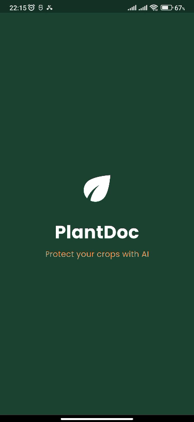
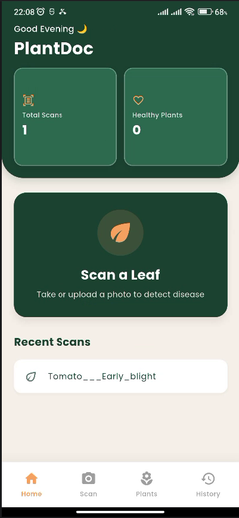
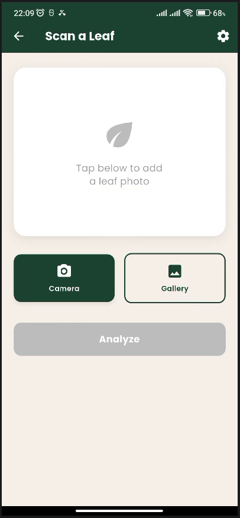
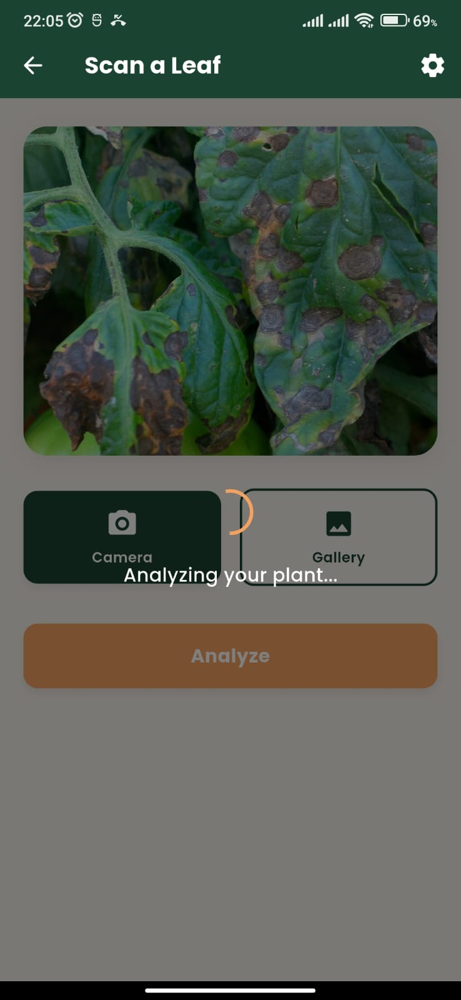
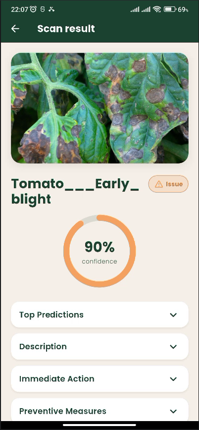
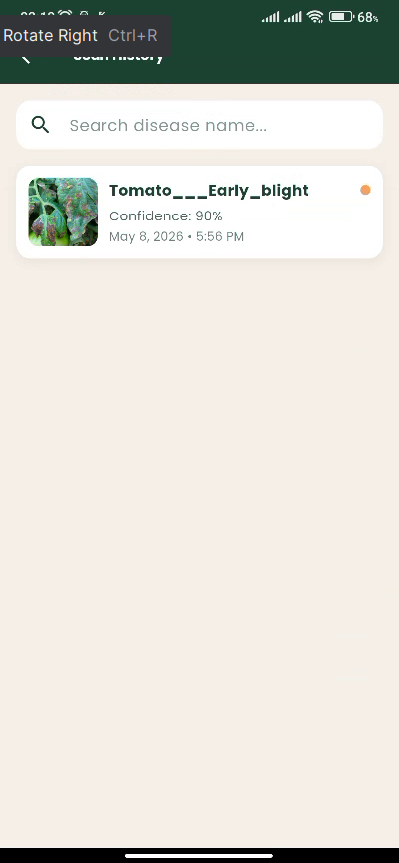
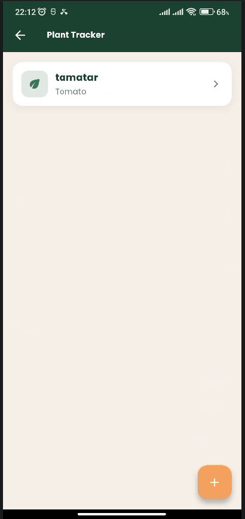
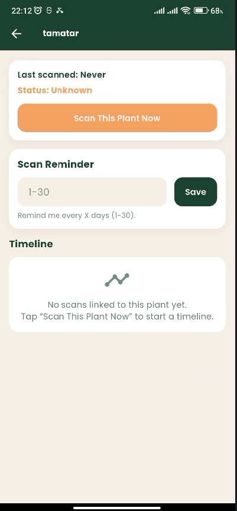

## Plant Disease Detection (Flutter + FastAPI)

Plant Disease is a **mobile/desktop Flutter app** backed by a **FastAPI** inference service that classifies plant-leaf images into disease categories (plus healthy/background).

This repository contains:

- **Flutter app**: UI, image capture/upload, history, tracker, and guides in `flutter/`
- **Backend API**: FastAPI + TensorFlow/Keras inference service in `backend/`

> Note: The backend expects a trained model at `model/best_model.keras`. If that file is missing, `/predict` will fail until you provide it (see “Model setup”).

---

## Features

- **Scan leaf images** from camera/gallery and get top predictions
- **History** of previous scans (stored on-device)
- **Plant tracker & reminders** (local notifications)
- **Backend health check** and robust error handling
- **Configurable backend base URL** (supports Android emulator vs. desktop/web defaults)

---

## App screenshots

<p>
  
  
  
</p>

<p>
  
  
  
</p>

<p>
  
  
</p>

---

## Project structure

```text
Plant-Disease/
  backend/                 # FastAPI inference service (TensorFlow/Keras)
  flutter/                 # Flutter application
  Resources/               # Misc assets/notes (non-code)
  running_Instruction.txt  # Quick backend run notes (Windows)
  README.md                # You are here
```

---

## Quickstart (Windows)

### 1) Backend (FastAPI)

Prerequisites:

- **Python 3.11 or 3.12** (TensorFlow support; avoid newer unsupported versions)

From the repo root (PowerShell):

```bash
py -3.11 -m venv backend/.venv
backend/.venv/Scripts/pip install -r backend/requirements.txt
backend/.venv/Scripts/uvicorn backend.app.main:app --reload --port 8000
```

Verify it’s running:

```bash
curl.exe http://127.0.0.1:8000/health
```

Optional: expose the backend to your LAN (useful for physical devices)

```bash
backend/.venv/Scripts/uvicorn backend.app.main:app --reload --host 0.0.0.0 --port 8001
```

Then:

- Use `http://127.0.0.1:8001` on your PC
- Use `http://<your_pc_lan_ip>:8001` on your phone (USB/wireless debugging)

### 2) Model setup (required for `/predict`)

The backend loads a Keras model from:

- Default: `model/best_model.keras` (relative to `backend/` via `MODEL_PATH=../model/best_model.keras`)

Do one of the following:

- **Option A (recommended)**: create `model/` at repo root and place `best_model.keras` inside it:

```text
Plant-Disease/
  model/
    best_model.keras
```

- **Option B**: point the backend to a different path using env var:
  - Copy `backend/.env.example` → `backend/.env`
  - Edit `MODEL_PATH` to your model location (relative to `backend/` or absolute)

### 3) Flutter app

Prerequisites:

- Flutter SDK installed (Dart SDK compatible with `flutter/pubspec.yaml` which targets `sdk: ^3.11.4`)

Run the app:

```bash
cd flutter
flutter pub get
flutter run
```

### Run on Android (emulator, USB, or wireless)

#### Android emulator

1. Create/start an emulator (Android Studio Device Manager)  
2. Run:

```bash
cd flutter
flutter devices
flutter run
```

Backend URL note: on the Android emulator, the app’s default backend base URL is `**http://10.0.2.2:8000**` (this maps to your host machine).
Backend URL note: on the Android emulator, the app’s default backend base URL is **`http://10.0.2.2:8000`** (this maps to your host machine).

#### Physical device over USB debugging

1. On your Android phone:
  - Enable **Developer options**
  - Enable **USB debugging**
2. Connect the phone via USB and accept the debugging prompt.
3. Confirm the device is detected:

```bash
cd flutter
flutter devices
flutter run -d <device_id>
```

Backend URL note: a real device cannot use `127.0.0.1` to reach your PC. Use your PC’s LAN IP (example `http://192.168.1.10:8000`) and make sure Windows Firewall allows inbound access to the backend port.

#### Physical device over wireless debugging

This uses ADB over Wi‑Fi (Android 11+ wireless debugging is recommended).

1. Enable **Wireless debugging** on the phone (Developer options).
2. Pair/connect with ADB (from a terminal):

```bash
adb pair <phone_ip>:<pairing_port>
adb connect <phone_ip>:<adb_port>
```

1. Run the app:

```bash
cd flutter
flutter devices
flutter run -d <device_id>
```

Backend URL note: same as USB—use your PC’s LAN IP in the app’s backend base URL.

---

## Backend API

Base URL: `http://127.0.0.1:8000` (default)

Endpoints:

- **GET** `/health` → `{ "status": "ok" }`
- **GET** `/meta` → class labels and metadata
- **POST** `/predict?top_k=5` → multipart form upload with key `file`

Example predict request (PowerShell):

```bash
$img = "C:\path\to\leaf.jpg"
curl.exe -X POST "http://127.0.0.1:8000/predict?top_k=5" -F "file=@$img"
```

If you started the backend on port 8001:

```bash
$img = "C:\path\to\leaf.jpg"
curl.exe -X POST "http://127.0.0.1:8001/predict?top_k=5" -F "file=@$img"
```

Response shape:

- `top_label`: best label
- `predictions`: array of `{ "label": string, "probability": number }`
- `model_path`: resolved model path actually used

### Backend configuration

The backend reads env vars from `backend/.env` (optional). See `backend/.env.example`:

- `MODEL_PATH`: path to `.keras` model (relative to `backend/` or absolute)
- `ALLOW_ORIGINS`: CORS allowed origins, comma-separated or `*`
- `DEFAULT_TOP_K`: default number of predictions returned
- `PRELOAD_MODEL`: `true` to load model at startup (fail fast)
- `MAX_UPLOAD_BYTES`: max upload size in bytes (default ~10MB)
- `LOG_LEVEL`: logging level

---

## Flutter ↔ Backend connectivity

The Flutter app uses a configurable base URL stored in preferences.

- **Default base URL**:
  - Android emulator: `http://10.0.2.2:8000`
  - Other platforms (iOS simulator, Windows/macOS/Linux, web): `http://127.0.0.1:8000`

If you run the backend on a different host/port (for example `0.0.0.0:8001`), update the app’s backend base URL accordingly.

Common scenarios:

- **Android emulator**: keep backend on your host machine at port 8000, app uses `10.0.2.2`
- **Physical Android device**: use your PC’s LAN IP (e.g. `http://192.168.1.10:8000`) and ensure firewall allows inbound traffic

---

## Troubleshooting

- **`/predict` returns “Model not found …”**
  - Put the model at `model/best_model.keras` or set `MODEL_PATH` in `backend/.env`.
- **TensorFlow install/import fails**
  - Use Python **3.11 or 3.12** and reinstall from `backend/requirements.txt`.
- **Flutter app can’t reach backend on Android emulator**
  - Use `http://10.0.2.2:8000` (Android emulator can’t reach `127.0.0.1` on your host via localhost).
- **CORS issues (web builds)**
  - Set `ALLOW_ORIGINS` to your web origin (or `*` for local dev).

---

## Development notes

- Backend dependency pins are in `backend/requirements.txt`.
- The backend is designed to be run from the repo root using:
  - `uvicorn backend.app.main:app --reload --port 8000`

---

## License

Add a license file if you plan to distribute this project.