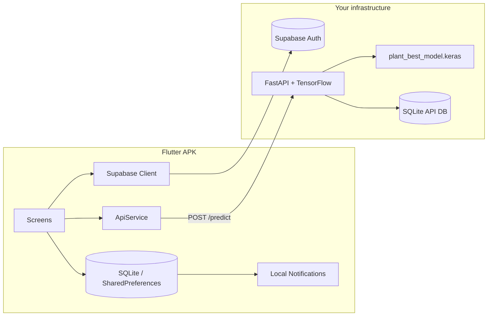

# PlantDoc — Plant Disease Detection

[](https://flutter.dev)
[](https://fastapi.tiangolo.com)
[](https://www.python.org)
[](https://www.tensorflow.org)

**PlantDoc** is a mobile-first plant health assistant aimed at helping growers—especially in agricultural contexts such as Nepal—identify crop diseases from leaf photos, follow care guidance, and track plantings over time. The app is a **Flutter** Android client; **machine learning runs on a FastAPI server**, not on the device. User sign-in uses **Supabase**; optional JWT-backed REST features live in the Python backend.

---

## Table of contents

- [Overview](#overview)
- [Features](#features)
- [Supported crops & model classes](#supported-crops--model-classes)
- [How it works](#how-it-works)
- [Tech stack](#tech-stack)
- [Repository structure](#repository-structure)
- [Prerequisites](#prerequisites)
- [Getting started](#getting-started)
- [Development workflows](#development-workflows)
- [Configuration reference](#configuration-reference)
- [REST API summary](#rest-api-summary)
- [Machine learning pipeline](#machine-learning-pipeline)
- [Plant tracker (local)](#plant-tracker-local)
- [Deployment & release APK](#deployment--release-apk)
- [Scripts reference](#scripts-reference)
- [Testing](#testing)
- [Troubleshooting](#troubleshooting)
- [Documentation index](#documentation-index)

---

## Overview

| Aspect | Detail |
|--------|--------|
| **Client** | Flutter (`flutter/`), Android-focused, dark glassmorphism UI |
| **Auth** | Supabase Auth (email/password) via `supabase_flutter` |
| **Inference** | Server-side Keras model — `model/plant_best_model.keras` |
| **Labels** | 20 classes in `Resources/class_names.json` |
| **Crops in UI** | Apple, Potato, Strawberry, Tomato (+ healthy / disease variants) |
| **Local data** | Scan history (`shared_preferences`), plant batches (`sqflite`), reminders (`flutter_local_notifications`) |

The release APK **must** point `API_BASE_URL` at a reachable HTTPS API. A build with `http://127.0.0.1:8000` only works when that address is your phone itself—not your development PC.

---

## Features

### Disease scanning

- Capture a leaf with the **camera** or pick from the **gallery**
- Image is uploaded as `multipart/form-data` to `POST /predict` (legacy) or `POST /api/v1/detect` (structured)
- Response includes disease name, confidence, healthy flag, and **treatment / prevention** text from the backend knowledge base
- Results screen shows recommendations and links to the plant tracker when relevant

### Authentication & profile

- Welcome → register / login through **Supabase**
- Session persisted; authenticated users land on **Home**
- Profile screen for account context (Supabase user metadata)

### Scan history

- Scans saved **locally** via `ScanStorage` for offline review
- History UI with activity tiles and past results
- Backend `/api/v1/history` available when using JWT (optional cloud sync path)

### Plant growth tracker

- Create **batches** (name, crop type, planting date)
- **Timeline** of growth milestones on batch detail
- **SQLite** persistence (`plant_batch_database.dart`)
- **Local notifications** every 14 days prompting a follow-up scan (`PlantReminderService`)
- Home screen shortcuts to active batches

### Knowledge base (API)

- Seeded **plant catalog** and **disease** records in SQLite on API startup
- `GET /api/v1/plants`, `GET /api/v1/diseases` for reference data
- Favorites API for authenticated users (`/api/v1/favorites`)

---

## Supported crops & model classes

The model outputs **20 softmax classes** (see `Resources/class_names.json`). The app UI highlights **four crops**:

| Crop | Example conditions detected |
|------|----------------------------|
| **Apple** | Scab, black rot, cedar apple rust, healthy |
| **Potato** | Early blight, late blight, healthy |
| **Strawberry** | Leaf scorch, healthy |
| **Tomato** | Bacterial spot, early/late blight, leaf mold, septoria, spider mites, target spot, viruses, mosaic, healthy |

Additional label: `Background_without_leaves` (non-leaf / invalid input).

Class order in `class_names.json` **must match** the model’s output neuron order. After retraining, update both the `.keras` file and JSON, then extend `backend/app/data/disease_metadata.py` for new labels.

---

## How it works

### System architecture


```mermaid
flowchart LR
  subgraph phone [Flutter APK]
    UI[Screens]
    SB[Supabase Client]
    API[ApiService]
    Local[(SQLite / SharedPreferences)]
    Notif[Local Notifications]
  end

  subgraph cloud [Your infrastructure]
    Supa[(Supabase Auth)]
    FastAPI[FastAPI + TensorFlow]
    Model[plant_best_model.keras]
    DB[(SQLite API DB)]
  end

  UI --> SB
  SB --> Supa
  UI --> API
  API -->|POST /predict| FastAPI
  FastAPI --> Model
  FastAPI --> DB
  UI --> Local
  Local --> Notif
```

### Scan request flow

1. User selects an image on **Scan** screen.
2. `ApiService.analyzePlant()` sends the file to `{API_BASE_URL}/predict?top_k=5`.
3. Backend resizes to **224×224**, applies MobileNetV2 `preprocess_input`, runs inference.
4. Top class is mapped through `disease_metadata.py` → human-readable disease, plant, recommendations.
5. Flutter navigates to **Scan result**; optional save to local history.

### Where data lives

| Data | Storage | Notes |
|------|---------|--------|
| User credentials / session | Supabase | `SUPABASE_URL`, `SUPABASE_ANON_KEY` in `flutter/.env` |
| Scan images (upload) | Backend `uploads/` | Ephemeral per request |
| API users, detections, favorites | Backend SQLite | Alembic migrations |
| Scan history (app) | Device `SharedPreferences` | Default path today |
| Plant batches | Device SQLite | Fully offline |
| Reminders | OS notification scheduler | Rescheduled on app start |

---

## Tech stack

### Mobile (`flutter/`)

| Package | Purpose |
|---------|---------|
| `supabase_flutter` | Authentication |
| `provider` | App state (`AuthProvider`, `PlantBatchProvider`) |
| `flutter_dotenv` | `.env` at runtime / in APK assets |
| `http` | Multipart upload to FastAPI |
| `image_picker`, `camera` | Capture & gallery |
| `sqflite` | Plant batch database |
| `flutter_local_notifications`, `timezone` | Scan reminders |
| `google_fonts`, `fl_chart`, `flutter_animate` | UI polish |

Design tokens: `lib/core/theme/` (`app_colors`, `app_theme`, spacing, radius). Reusable widgets under `lib/core/widgets/`.

### Backend (`backend/`)

| Package | Purpose |
|---------|---------|
| `fastapi`, `uvicorn` | HTTP API |
| `tensorflow` | Load `.keras` model, inference |
| `opencv-python-headless`, `pillow` | Image decode & resize |
| `sqlalchemy`, `alembic` | ORM & migrations |
| `python-jose`, `bcrypt` | JWT auth (API users) |
| `supabase` | Optional server-side Supabase integration |
| `pytest` | API tests |

---

## Repository structure

```text
Plant-Disease/
├── flutter/                    # Flutter Android app
│   ├── lib/
│   │   ├── core/               # Theme, widgets, services, navigation
│   │   ├── features/plant_tracker/
│   │   └── screens/            # welcome, home, scan, history, tracker, …
│   ├── android/                # Manifest, permissions, cleartext (dev)
│   ├── assets/images/
│   ├── .env.example            # Template for Supabase + API URL
│   └── pubspec.yaml
├── backend/
│   ├── app/
│   │   ├── api/routes/         # auth, detect, history, plants, diseases, favorites
│   │   ├── services/           # disease_detection, auth, seed_data
│   │   ├── models/             # SQLAlchemy models
│   │   ├── data/               # disease_metadata.py (recommendations)
│   │   └── main.py
│   ├── alembic/                # DB migrations
│   ├── tests/
│   └── requirements.txt
├── model/
│   └── plant_best_model.keras  # Required for inference (not always in git)
├── Resources/
│   └── class_names.json        # 20-class label list
├── scripts/                    # PowerShell dev automation (Windows)
│   ├── setup.ps1
│   ├── dev-usb.ps1
│   ├── dev-wifi.ps1
│   └── backend.ps1
├── docs/
│   └── CLOUD_SETUP.md          # Production API + APK guide
├── Dockerfile                  # Root image: API + model + Resources
├── docker-compose.yaml
├── running_Instruction.md      # Detailed run & troubleshoot guide
└── README.md                   # This file
```

---

## Prerequisites

| Requirement | Notes |
|-------------|--------|
| **Python 3.11** | Virtualenv under `backend/.venv` |
| **Flutter SDK** | Run `flutter doctor`; Android toolchain required |
| **Android SDK / adb** | USB debugging; path in `scripts/config.ps1` |
| **Supabase project** | [supabase.com](https://supabase.com) → API URL + anon key |
| **Trained model** | `model/plant_best_model.keras` at repo root |
| **Docker** (optional) | For containerized API |

Verify tools:

```powershell
python --version
flutter doctor -v
adb version
```

---

## Getting started

### 1. Clone and install dependencies

```powershell
git clone https://github.com/YOUR_ORG/Plant-Disease.git
cd Plant-Disease
.\scripts\setup.ps1
```

`setup.ps1` creates the Python venv, installs requirements, runs `alembic upgrade head`, and runs `flutter pub get`.

**macOS / Linux** (manual equivalent):

```bash
cd backend
python3.11 -m venv .venv && source .venv/bin/activate
pip install -r requirements.txt
cp .env.example .env   # edit SECRET_KEY
alembic upgrade head

cd ../flutter
flutter pub get
cp .env.example .env   # edit Supabase + API_BASE_URL
```

### 2. Configure environment files

**`flutter/.env`** (copy from `flutter/.env.example`):

```env
SUPABASE_URL=https://xxxxxxxx.supabase.co
SUPABASE_ANON_KEY=eyJhbGciOiJIUzI1NiIsInR5cCI6IkpXVCJ9...
API_BASE_URL=http://127.0.0.1:8000
```

**`backend/.env`** (copy from `backend/.env.example`):

- Set a strong `SECRET_KEY` for JWT signing.
- Keep `MODEL_PATH` / `CLASS_NAMES_PATH` unless you relocate assets.
- Add `SUPABASE_*` only if using server-side scan persistence.

Never commit real secrets. `.env` files are gitignored; Flutter bundles `.env` into release builds via `pubspec.yaml` assets.

### 3. Run on a physical device (Windows shortcut)

```powershell
.\scripts\dev-usb.ps1
```

Starts the API in a new window, `adb reverse tcp:8000 tcp:8000`, and `flutter run` with the correct API URL.

**Full step-by-step instructions, emulator notes, and Wi‑Fi setup:** [running_Instruction.md](running_Instruction.md)

---

## Development workflows

| Mode | When to use | API URL on phone |
|------|-------------|------------------|
| **USB + `dev-usb.ps1`** | Default Windows dev | `http://127.0.0.1:8000` (via `adb reverse`) |
| **Wi‑Fi + `dev-wifi.ps1`** | No USB cable; same LAN | `http://<PC_LAN_IP>:8000` |
| **Manual** | IDE debugging | Set in `.env` or `--dart-define=API_BASE_URL=...` |
| **Android emulator** | No physical device | `http://10.0.2.2:8000` (host loopback) |
| **Release APK** | Production / field testing | Public `https://` API only |

Backend must listen on `0.0.0.0` for LAN access:

```powershell
cd backend
. .venv\Scripts\activate
uvicorn app.main:app --reload --host 0.0.0.0 --port 8000
```

**API URL resolution order** in the Flutter app (`ApiService.configure`):

1. `--dart-define=API_BASE_URL=...` (build-time override)
2. `API_BASE_URL` in `flutter/.env`
3. Default dev fallback `http://127.0.0.1:8000`

---

## Configuration reference

### Flutter environment

| Variable | Required | Description |
|----------|----------|-------------|
| `SUPABASE_URL` | Yes | Project URL, e.g. `https://xxx.supabase.co` (not the REST path) |
| `SUPABASE_ANON_KEY` | Yes | Public anon key from Supabase dashboard |
| `API_BASE_URL` | Yes for scans | FastAPI base URL, no trailing slash |

### Backend environment (common)

| Variable | Default / notes |
|----------|-----------------|
| `SECRET_KEY` | JWT signing; change in production |
| `MODEL_PATH` | `../model/plant_best_model.keras` |
| `CLASS_NAMES_PATH` | `../Resources/class_names.json` |
| `DATABASE_URL` | SQLite under `backend/` |
| `CORS_ORIGINS` | `["*"]` for dev; restrict in production |
| `SUPABASE_URL`, `SUPABASE_SERVICE_ROLE_KEY` | Optional server integration |

### Scripts config (`scripts/config.ps1`)

Copy from `scripts/config.example.ps1`:

| Variable | Purpose |
|----------|---------|
| `$LanIp` | Your PC IPv4 for Wi‑Fi dev |
| `$ApiPort` | Usually `8000` |
| `$AdbPath` | Path to `adb.exe` |

---

## REST API summary

Base URL: `http://127.0.0.1:8000` (local). Interactive docs: **http://127.0.0.1:8000/docs**

| Method | Path | Auth | Description |
|--------|------|------|-------------|
| `GET` | `/health` | No | Liveness + model loaded flag |
| `POST` | `/predict` | Optional | **Legacy** — used by Flutter today |
| `POST` | `/api/v1/detect` | Optional | Structured detection response |
| `POST` | `/api/v1/auth/register` | No | API user registration |
| `POST` | `/api/v1/auth/login` | No | JWT access + refresh |
| `GET` | `/api/v1/history` | Bearer | User detection history |
| `GET` | `/api/v1/plants` | No | Plant catalog |
| `GET` | `/api/v1/diseases` | No | Disease knowledge base |
| `POST/GET/DELETE` | `/api/v1/favorites` | Bearer | Saved items |

**Example — health check:**

```bash
curl http://127.0.0.1:8000/health
```

**Example — analyze a leaf (same as the app):**

```bash
curl -X POST "http://127.0.0.1:8000/predict?top_k=5" \
  -F "file=@path/to/leaf.jpg"
```

**Example response fields (legacy):** `disease`, `confidence`, `isHealthy`, `recommendations`

More detail: [backend/README.md](backend/README.md)

---

## Machine learning pipeline

| Property | Value |
|----------|--------|
| **File** | `model/plant_best_model.keras` |
| **Architecture** | MobileNetV2-based classifier |
| **Input** | 224 × 224 × 3 RGB, `mobilenet_v2.preprocess_input` |
| **Output** | 20-class softmax |
| **Labels** | `Resources/class_names.json` |
| **Metadata** | `backend/app/data/disease_metadata.py` |

The model is loaded once at API startup (`lifespan` in `main.py`). If the file is missing, `/health` may respond but inference returns **503**.

**Replacing the model:**

1. Drop your new `.keras` file at `model/plant_best_model.keras`.
2. Update `class_names.json` to match output indices.
3. Extend `disease_metadata.py` for any new labels.
4. Restart the API or rebuild the Docker image.

Training logs / resources (if present): `Resources/p1_log.csv`, `Resources/p2_log.csv`.

---

## Plant tracker (local)

Plant batches are **device-only**—no sync to Supabase by default.

| Concept | Behavior |
|---------|----------|
| **Batch** | Name, crop type (`AppStats.supportedCrops`), planting date |
| **Reminders** | First scan due 14 days after planting, then every 14 days |
| **Storage** | `sqflite` table via `PlantBatchDatabase` |
| **UI** | Tracker list → batch detail with `BatchTimeline` |
| **Notifications** | `PlantReminderService` reschedules on app launch |

Permissions: Android **notifications** (and **camera** for scans) in `AndroidManifest.xml`.

---

## Deployment & release APK

### Docker (local or VPS)

```powershell
# From repo root — model file must exist
docker compose up --build
```

- Image built from root `Dockerfile` (includes `backend/`, `model/`, `Resources/`).
- Health check on `/health`; cold start may take ~2 minutes while TensorFlow loads.

### Cloud API

Deploy to Railway, Render, Fly.io, or similar. Set `SECRET_KEY` and expose HTTPS. Full checklist: **[docs/CLOUD_SETUP.md](docs/CLOUD_SETUP.md)**

### Build installable APK

```powershell
cd flutter
flutter pub get

# Ensure flutter/.env has production API_BASE_URL=https://your-api.example.com
flutter build apk --release

# Or override at build time:
flutter build apk --release --dart-define=API_BASE_URL=https://your-api.example.com
```

**Output:** `flutter/build/app/outputs/flutter-apk/app-release.apk`

Install:

```powershell
adb install -r flutter\build\app\outputs\flutter-apk\app-release.apk
```

---

## Scripts reference

All scripts run from the **repository root** (Windows PowerShell).

| Script | Action |
|--------|--------|
| `.\scripts\setup.ps1` | First-time backend venv + migrations + `flutter pub get` |
| `.\scripts\dev-usb.ps1` | API window + `adb reverse` + `flutter run` |
| `.\scripts\dev-wifi.ps1` | API window + `flutter run` with LAN IP |
| `.\scripts\backend.ps1` | Start API in current terminal only |

---

## Testing

```powershell
cd backend
. .venv\Scripts\activate
pytest -q
```

Includes health and auth route tests under `backend/tests/`.

Flutter widget tests (if added): `cd flutter && flutter test`

---

## Troubleshooting

| Symptom | Likely cause | Fix |
|---------|--------------|-----|
| “Cannot reach the analysis server” | Wrong or local `API_BASE_URL` on APK | Use public HTTPS URL; see [docs/CLOUD_SETUP.md](docs/CLOUD_SETUP.md) |
| Connection refused on phone | Backend not running or firewall | Start uvicorn; allow port 8000 |
| `adb reverse` fails | USB debugging off / unauthorized | Enable dev options; `adb devices` |
| 503 on scan | Model file missing on server | Add `model/plant_best_model.keras` |
| Wrong disease names | Label order mismatch | Sync `class_names.json` with model |
| Supabase login fails | Bad URL or key | Use project URL, not `/rest/v1/` |
| Reminders not showing | Permission denied | Grant notifications; reopen app |

Extended troubleshooting: **[running_Instruction.md](running_Instruction.md)**

---

## Documentation index

| Document | Contents |
|----------|----------|
| [running_Instruction.md](running_Instruction.md) | Complete runbook: setup, USB/Wi‑Fi, emulator, APK, cheat sheet |
| [backend/README.md](backend/README.md) | API routes, Docker, model layout, curl examples |
| [docs/CLOUD_SETUP.md](docs/CLOUD_SETUP.md) | Why APK needs cloud API, deploy steps, platform notes |
| [flutter/DESIGN_SPEC.md](flutter/DESIGN_SPEC.md) | UI design system for contributors |
| [flutter/README.md](flutter/README.md) | Legacy starter-kit notes (partially superseded) |

---

## License

Add or reference a `LICENSE` file in the repository root. Until then, treat usage according to your organization’s terms.

**Contributing:** Open issues or PRs with focused changes; match existing folder layout (`core/`, `features/`, `screens/`) and run `pytest` / `flutter analyze` before submitting.
