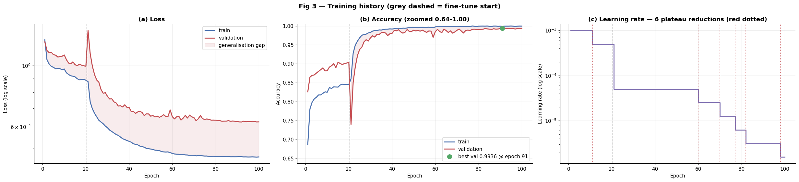

# PlantDoc — Plant Disease Detection

[](https://flutter.dev)
[](https://www.tensorflow.org/lite)
[](https://fastapi.tiangolo.com)

Identify crop diseases from a single leaf photo — **on the phone, with no internet
connection.** Built for growers in the field, with treatment and prevention guidance
for every diagnosis.

## Download

| APK | For |
|---|---|
| **[PlantDoc-arm64.apk](https://github.com/suj4n/Plant-Disease/releases/latest/download/PlantDoc-arm64.apk)** (~39 MB) | Almost every Android phone (Android 7.0 or newer) |
| [PlantDoc-universal.apk](https://github.com/suj4n/Plant-Disease/releases/latest/download/PlantDoc-universal.apk) (~85 MB) | Any device — use this if the one above won't install |

Android will ask you to allow installing from this source the first time.
All versions: [Releases](https://github.com/suj4n/Plant-Disease/releases).

## Features

- **Offline diagnosis** — the model runs on the phone, so scans work without internet
- **4 crops, 20 classes** — 19 disease and healthy classes for Apple, Potato, Strawberry and Tomato, plus a "no leaf" class that rejects photos without a leaf
- **Guidance** — symptoms, treatment and prevention for each disease, with a risk level
- **Accounts on the phone** — sign up with your full name and a password; no email or internet needed, and passwords are stored only as a one-way hash
- **Fingerprint login** — turn it on in Profile → Security (needs a fingerprint registered in the phone's settings)
- **Guest mode** — use the app without an account; guests can track one plant batch
- **Scan history and plant tracker** — saved on the phone, with a reminder to re-scan each plant every 14 days

## Model

MobileNetV2 fine-tuned on the PlantVillage dataset (26,191 images), exported to
TensorFlow Lite (float32, 12 MB).

| Metric (held-out test set, 2,620 images) | Score |
|---|---|
| Accuracy | **99.39%** |
| Macro F1 | 0.9945 |
| Macro AUC | 0.9998 |
| Errors | 16 |



Train and validation accuracy finish within 0.7 points of each other, and
validation loss levels off at its lowest in the final epochs rather than rising,
so the model is not overfitting. All evaluation figures are in
[`Resources/__results___images/`](Resources/__results___images/).

**Limitations:** PlantVillage images are single leaves on plain backgrounds, so
expect lower accuracy on photos taken in the field with soil, other foliage or
strong shadows. Grad-CAM samples suggest the model also draws on the photo
background, not only the leaf.

## How it works

```
Photo ─► resize to 224×224 ─► TFLite model (on the phone) ─► disease + guidance
                                      │
                                      └─ only if on-device inference fails ─► FastAPI server
```

- **App** (`flutter/`) — Flutter; on-device inference, accounts, fingerprint login, scan history and plant tracker (SQLite + local notifications). Nothing is stored off the phone.
- **Server** (`backend/`) — FastAPI + TensorFlow running the same model. It is only a fallback: a photo is sent there only if on-device inference fails, and it is not kept.
- **Model** (`model/`) — the trained Keras model; image preprocessing is built into the model.

## Run it yourself

**Backend** (optional — only the fallback)

```bash
cd backend
python -m venv .venv
.venv/Scripts/pip install -r requirements.txt   # macOS/Linux: .venv/bin/pip
cp .env.example .env
.venv/Scripts/python -m uvicorn app.main:app --port 8000
```

**App** — set `API_BASE_URL` in `flutter/.env` to the fallback server's address, then:

```bash
cd flutter
flutter pub get
flutter run
```

**Build the APKs**

```bash
cd flutter
flutter build apk --release --split-per-abi   # per-device APKs
flutter build apk --release                   # universal APK
```

**After retraining** — copy the new `plant_best_model.keras` to `model/`, then
regenerate the phone model and disease knowledge base. This also checks the phone
model against the Keras one:

```bash
backend/.venv/Scripts/python scripts/export_tflite.py
```

## Tests

```bash
cd backend && .venv/Scripts/python -m pytest -q
cd flutter && flutter test
```

## Project structure

```
flutter/     Android app (Flutter)
backend/     FastAPI fallback server
model/       Trained Keras model
Resources/   Class labels, training logs, evaluation figures
scripts/     Setup, dev and model-export scripts
```
